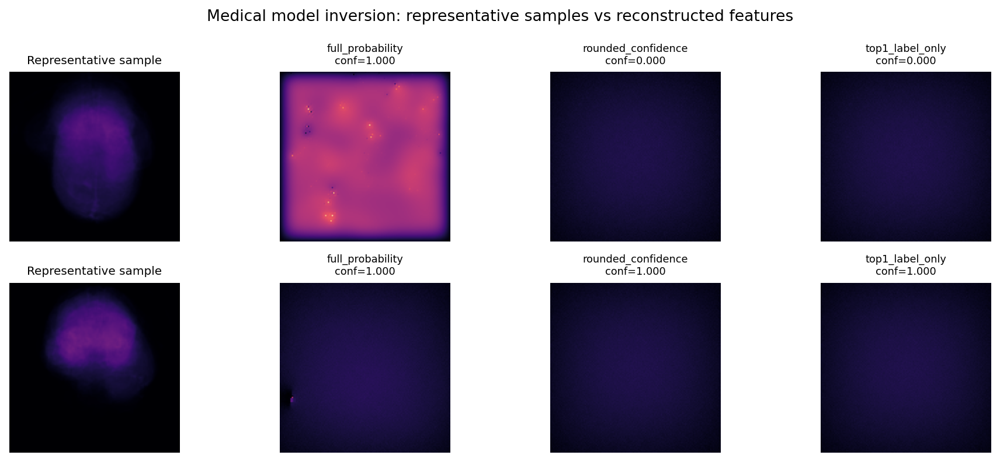
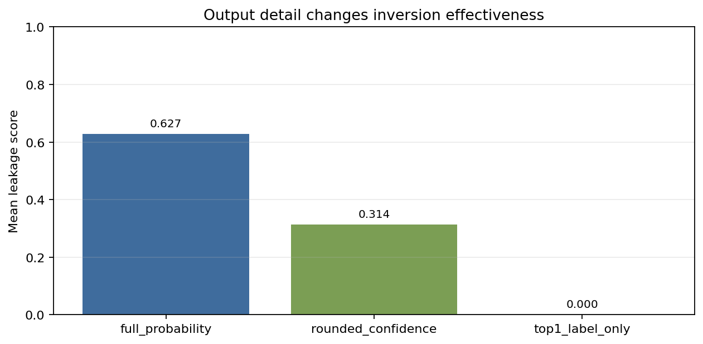

# Brain Tumor MRI Model Inversion Privacy Assessment

## Baseline Model Behavior

- Validation accuracy: 49.17%
- Mean confidence: 89.67%
- P95 confidence: 99.98%
- Mean output entropy: 0.2426

## Inversion Leakage Summary

| Output configuration | Mean leakage score |
|----------------------|--------------------|
| full_probability | 0.627 |
| rounded_confidence | 0.314 |
| top1_label_only | 0.000 |

## Visual Evidence

## Risk Assessment

The full probability interface provides the strongest optimization signal for repeated-query inversion. Rounded confidence scores reduce the useful signal, and label-only outputs remove most of the probability gradient that makes the attack efficient.

For a cloud brain tumor screening API processing approximately 10,000 patient images per week, the primary operational risk is unrestricted inference access combined with detailed probability vectors. Attackers could enumerate target classes, run many queries, and build representative reconstructions of sensitive MRI features from the model's behavior.

## Mitigation Recommendations

- Return top-1 labels or coarse risk bands unless calibrated probabilities are clinically required.
- Clip or round confidence scores and monitor repeated-query patterns.
- Apply rate limits, authentication, and anomaly detection to public inference endpoints.
- Evaluate overfitting before deployment and consider differential privacy for sensitive training pipelines.
- Document output exposure and privacy testing in model approval reviews.
