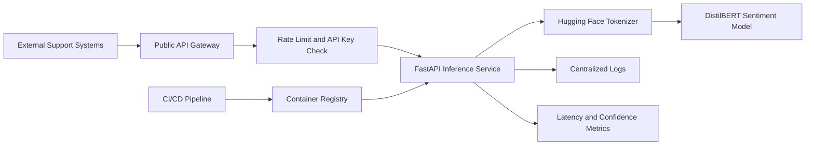

# Deployment Architecture

## System Summary

SupportSentiment is a public-facing sentiment classification service used by customer-support tooling. The service accepts ticket text and returns a sentiment label, confidence score, model version, and latency metric. Downstream workflow automation is planned but not yet enabled.

## Trust Boundaries

| Boundary | Description | Primary Concern |
|----------|-------------|-----------------|
| Internet to API Gateway | External clients send JSON requests with API keys | Abuse, scraping, malformed payloads, rate limit bypass |
| API Gateway to Inference Service | Authenticated traffic reaches the internal FastAPI container | Missing authorization context, request smuggling, schema gaps |
| Inference Service to Model Runtime | Application code tokenizes text and calls the Transformer model | Adversarial text, resource exhaustion, unsafe preprocessing |
| Inference Service to Observability | Requests, labels, and errors are logged | Sensitive ticket data exposure |
| CI/CD to Container Registry | Model image is built and deployed | Dependency and model artifact supply chain risk |

## Architecture Diagram

## Deployment Assumptions

- The API gateway enforces API key authentication and per-key rate limits.
- The inference service accepts up to 4096 characters in the `text` field.
- Request metadata allows additional JSON properties for future support channels.
- Logs currently include `ticket_id`, `customer_id`, predicted label, confidence score, and error messages.
- The `/health` endpoint is unauthenticated and returns model metadata.
- The container image is rebuilt weekly from a pinned Python base image and a `requirements.txt` file.
