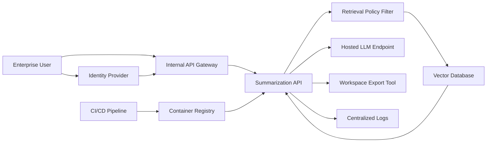

# Deployment Architecture

## System Summary

EnterpriseSummarizer is an internal RAG service that summarizes HR, finance, engineering, and operations documents. It is approved for limited deployment and processes approximately 12,000 documents per day.

## Architecture Diagram

## Trust Boundaries

| Boundary | Description | Primary Concern |
|----------|-------------|-----------------|
| User to API Gateway | Authenticated employees submit summary requests | Prompt injection, excessive access requests, abuse of valid accounts |
| API Gateway to Summarization API | Bearer token and department claims are forwarded | Authorization drift, missing claim validation |
| Summarization API to Vector Database | Application retrieves document chunks | Unauthorized retrieval, cross-department leakage |
| Summarization API to LLM Endpoint | Retrieved chunks and user query are sent to the model | Data leakage, prompt injection, policy bypass |
| Summarization API to Export Tool | Summaries can be exported to workspace locations | Insecure tool use, data exfiltration |
| Application to Logs | Requests, retrieval metadata, and errors are logged | Sensitive document leakage in telemetry |

## Deployment Assumptions

- Users authenticate through the enterprise identity provider.
- Department claims are used to filter document retrieval.
- The vector database stores embeddings and metadata for internal and confidential documents.
- The hosted LLM endpoint is configured through an internal proxy.
- The export tool should only write summaries to approved department workspaces.
- Logs include user ID, department, requested document scope, retrieval count, latency, and error messages.
