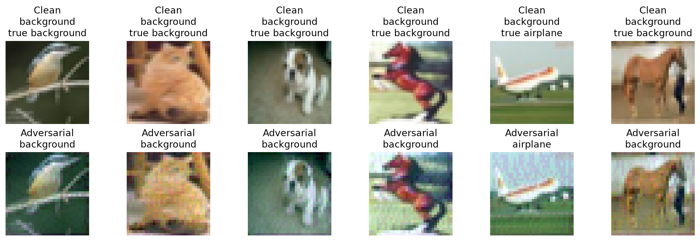

# Metrics Filled Out

Values below are the reference run committed as `adversarial_metrics_baseline.csv`.

| Attack | Epsilon | Clean Accuracy | Adversarial Accuracy | Attack Success Rate | Mean Clean Confidence | Mean Adversarial Confidence | Mean Linf | Mean L2 |
|--------|---------|----------------|----------------------|---------------------|-----------------------|-----------------------------|-----------|---------|
| pgd | 0.01 | 0.7417 | 0.7083 | 0.0899 | 0.7586 | 0.723 | 0.01 | 0.5259 |
| pgd | 0.03 | 0.7417 | 0.6917 | 0.2584 | 0.7586 | 0.6907 | 0.03 | 1.5436 |
| pgd | 0.06 | 0.7417 | 0.6167 | 0.4494 | 0.7586 | 0.6861 | 0.06 | 3.0576 |

## Comparison Grid

Highest-epsilon result (PGD, epsilon `0.06`) — clean images on the top row, adversarial
versions on the bottom row, each labelled with the model's prediction:

## Notes

- Attack success rate should be measured on examples that were correctly classified before attack.
- For this security scenario, false negatives are especially important because missed aerial object detections can suppress alerts.
- Clean accuracy is identical across all three rows because the same clean evaluation set is
  scored once; only the perturbation budget changes between rows.
- As epsilon rises from `0.01` to `0.06`, adversarial accuracy falls and attack success rate
  climbs, while mean `Linf` tracks epsilon exactly and mean `L2` grows roughly linearly.
- Your own numbers will differ from this baseline. `prepare_airplane_assets.py` seeds the
  dataset split (`seed=7`) but not model training, so each prepared checkpoint starts from
  different weights and reaches a slightly different clean accuracy.
