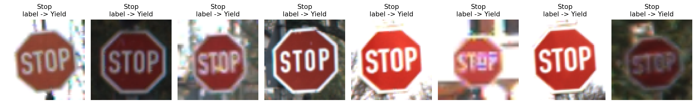

# Poisoned Training Dataset Assessment Report

Reference answer for the assessment report. Learners copy
`docs/assessment_report_template.md` into `results/assessment_report.md` and fill
it in there; this `_baseline` copy is the completed version for instructors.

Every number below comes from one seeded run of
`notebooks/traffic_sign_label_flip_poisoning_assessment.ipynb` and matches
`label_flip_metrics_baseline.csv` in this directory.

## Configuration

- Source class: Stop
- Target class: Yield
- Poison fraction: 0.75 of source-class training samples (150 of 200 Stop labels flipped)
- Training subset size: 1,200 samples (6 classes x 200)
- Validation subset size: 600 samples (6 classes x 100)

## Quantitative Results

| Model | Clean Accuracy | Source-Class Accuracy | Targeted Misclassification Rate |
| --- | ---: | ---: | ---: |
| Clean baseline | 0.952 | 0.910 | 0.000 |
| Poisoned model | 0.802 | 0.000 | 0.990 |

Mean prediction confidence stays high in both models — 0.966 clean, 0.919
poisoned — so confidence gives no warning that anything is wrong.

## Label-Flip Examples

The images themselves are untouched and correctly show `Stop`; only the labels
have been rewritten to `Yield`.

## Findings

The attack relabeled 75% of the Stop training images as Yield, leaving the images
themselves untouched. Aggregate clean accuracy fell only 15 points, from 0.952 to
0.802, which a single accuracy gate could plausibly wave through. The class-level
picture is far worse: Stop accuracy collapsed from 0.910 to 0.000, and 99.0% of
clean Stop validation images were predicted as Yield. No trigger is present at
inference time — the corruption lives entirely in the training labels, so the
model is confidently wrong on clean input.

Aggregate accuracy alone concealed a total, class-specific failure. Per-class
accuracy and a targeted source-to-target rate are the metrics that expose it.

## Operational Risk

A model that confuses Stop with Yield can cause an autonomous shuttle or
traffic-monitoring system to miss stop signs entirely on clean camera input. This
is a training-pipeline integrity failure, not an inference-time perturbation
problem: no attacker access to the deployed system is needed, and the defect
survives every input-side defence. In a transportation setting it is an immediate
safety risk, and a deployment gate that reads only aggregate validation accuracy
would not catch it.

## Mitigations

- Dataset provenance and signed, auditable label sources.
- Independent label review for safety-critical classes, sampled or exhaustive.
- Per-class validation gates rather than a single aggregate accuracy threshold.
- Monitoring for label-distribution shift between training runs.
- Access controls on the training pipeline and its label store.
- Model comparison against a known-good baseline before deployment, including the
  targeted source-to-target misclassification rate.
